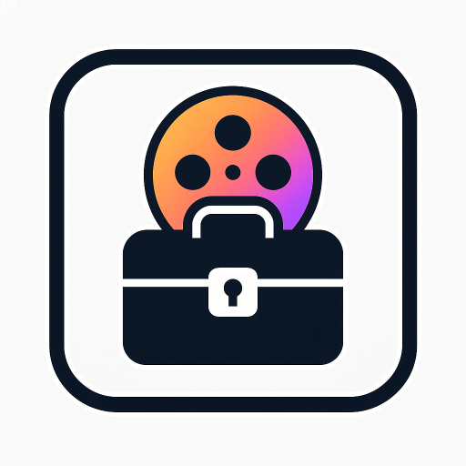

# Media Indexer & DAM Toolbox

[](https://github.com/Cdaprod/ThatDAMToolbox/actions/workflows/ci-build-and-publish.yml)

<div align="center">

<p>
  <a href="https://youtube.com/@Cdaprod">
    
  </a>
  <a href="https://twitter.com/cdasmktcda">
    
  </a>
  <a href="https://www.linkedin.com/in/cdasmkt">
    
  </a>
  <a href="https://github.com/Cdaprod">
    
  </a>
  <a href="https://sanity.cdaprod.dev">
    
  </a>
</p>

</div>

**By David Cannan (@Cdaprod)**

> **AI-Powered Digital Asset Management System**  
> Advanced media processing, hierarchical embedding generation, and intelligent content discovery for modern video workflows.

## Overview

A comprehensive Digital Asset Management (DAM) system that combines traditional media indexing with advanced AI-powered video processing. Built for content creators, video professionals, and organizations managing large media libraries.

### System Architecture

```
Browser  →  FastAPI  →  Database
              ↘︎  Worker Queue → ML Workers (AI/ffmpeg)
              ↘︎  /data Volume → Raw Media Assets
```

## Table of Contents

- [Core Features](#core-features)
- [AI Video Processing](#ai-video-processing)
- [System Architecture](#system-architecture-details)
- [Hardware Context](#hardware-context)
- [Installation](#installation)
- [Quick Start](#quick-start)
- [API Documentation](#api-documentation)
- [Development Roadmap](#development-roadmap)
- [Contributing](#contributing)
- [License](#license)

## Core Features

### ✨ AI-Powered Media Processing

- **Hierarchical Video Embeddings**: Multi-layer (L0-L3) vector representations
- **Intelligent Content Discovery**: Semantic search across video libraries
- **Automated Metadata Enrichment**: AI-generated descriptions, tags, and classifications
- **Smart Frame Extraction**: Automatic key-frame and hero-image selection

### 🎬 Professional Video Workflows

- **Multi-Camera Sync**: Audio waveform analysis for perfect alignment
- **Motion Detection & Tracking**: Advanced computer vision capabilities
- **Speech-to-Text Processing**: Automated transcription with timeline sections
- **Blender Integration**: Direct pipeline to 3D workflows

### 🔄 Content Management

- **Batch Processing**: Efficient handling of large media collections
- **Network Sync**: SMB/NAS integration with metadata preservation
- **Stock Platform Publishing**: Automated uploads to licensing platforms
- **iPhone Photos Integration**: Seamless HEIC/ProRes import workflows

## AI Video Processing

### Hierarchical Embedding System

The core innovation of this DAM system is its multi-level video understanding:

```mermaid
sequenceDiagram
    participant UI as Browser
    participant JS as app.js
    participant Scan as BatchScanner
    participant API as /video.server (FastAPI)
    participant DAM as /api/embedding router
    participant Store as VectorStorage

    Note over UI,JS: User drops a folder into web UI
    JS->>Scan: POST /scan?dir=/media/batch1
    Scan->>Scan: Walk dir, find foo.mp4
    Scan->>API: POST /api/embedding/videos/ingest {path:”/media/batch1/foo.mp4”}
    API->>DAM: forward call
    DAM->>Store: store L0 vector
    DAM—>>API: {uuid:”abcd-1234”, levels:{L0:1}}
    API—>>Scan: 200 OK
    Note right of DAM: background task<br/>generates L1–L3
```

### Processing Levels

- **L0**: Raw video ingestion and basic metadata
- **L1**: Frame-level analysis and feature extraction
- **L2**: Scene segmentation and content understanding
- **L3**: Semantic relationships and cross-video connections

## System Architecture Details

### Application Stack

```mermaid
graph TD;
  CLI[“video/ (CLI)”] —>|same code| API(FastAPI Service);
  API —>|JSON| VanillaWeb[Vanilla JS Dashboard];
  API —>|JSON| Streamlit[Optional Streamlit Service];
  
  subgraph Storage
    SMB[Workspace /mnt/b/] & NAS[Archive /mnt/nas/]
  end
  
  SMB & NAS —> HostBindMount
  HostBindMount —>|bind mounts| API
```

### API Endpoints

The FastAPI server provides comprehensive REST endpoints:

- `/motion/extract` - Motion Detection & Analysis
- `/scan` - File Discovery & Indexing
- `/search` - Content Search & Filtering
- `/batches` - Batch Processing Management
- `/backup` - Backup Operations
- `/sync_album` - Album Synchronization
- `/paths` - Path Management
- `/jobs` - Job Monitoring & Status

## Hardware Context

### Device Integration Matrix

The system integrates with various hardware and virtual devices for optimal performance:

```mermaid
graph RL
    subgraph “Input Sources”
        CAM[IP Cameras<br/>Network Sources]
        FILES[Video Files<br/>Local Storage]
        UPLOAD[Upload Sources<br/>HTTP/API]
        BACKUP[Backup Sources<br/>External Storage]
    end

    subgraph “Network Devices”
        ETH[eth0 - Network Interface]
        DOCKER[docker0 - Bridge Interface]
        LO[lo - Loopback Interface]
    end

    subgraph “Character Devices (/dev/c)”
        VIDEO0[“/dev/video* - Camera Nodes”]
        RANDOM[“/dev/random - Entropy Source”]
        NULL[“/dev/null - Null Device”]
    end

    subgraph “Block Devices (/dev/b)”
        SSD[“/dev/sda - Primary Storage”]
        BACKUP_DISK[“/dev/sdb - Backup Storage”]
        LOOP[“/dev/loop0 - Loop Device”]
    end

    subgraph “API Application”
        API[Video API Server<br/>Port 8080<br/>FastAPI/Uvicorn]
    end

    CAM —> ETH
    FILES —> SSD
    UPLOAD —> DOCKER
    BACKUP —> BACKUP_DISK
    VIDEO0 —> API
    ETH —> API
    SSD —> API
```

## Installation

### Prerequisites

- Python 3.8+
- Docker (recommended)
- FFmpeg
- CUDA-capable GPU (optional, for AI acceleration)

### Docker Setup (Recommended)

```bash
# Clone the repository
git clone https://github.com/Cdaprod/ThatDAMToolbox.git
cd ThatDAMToolbox

# Build and run with Docker Compose
docker-compose up -d

# Access the web interface
open http://localhost:8080
```

### Manual Installation

```bash
# Install dependencies
pip install -r requirements.txt

# Initialize database
python -m video.db init

# Start the server
uvicorn video.server:app —host 0.0.0.0 —port 8080
```

## Quick Start

### Basic Usage

```python
from video import MediaIndexer

# Initialize the indexer
indexer = MediaIndexer()

# Scan a directory
indexer.scan(“/path/to/media”)

# Get recent files
recent_media = indexer.get_recent()

# Search content
results = indexer.search(“sunset beach”)
```

### Web Interface

1. Navigate to `http://localhost:8080`
1. Drop media files or folders onto the interface
1. Monitor processing progress in real-time
1. Search and explore your indexed content

### Workflow Automation

Create JSON workflows for complex operations:

```json
{
  “workflow”: [
    {
      “action”: “sync_album”,
      “root”: “/media/workspace”,
      “album”: “Project Alpha”,
      “category”: “edit”,
      “copy”: true
    },
    { “action”: “scan”, “root”: “/media/incoming” },
    { “action”: “backup”, “backup_root”: “/media/archive” },
    { “action”: “stats” }
  ]
}
```

## API Documentation

### Core Endpoints

#### Scan Media Directory

```http
POST /scan?dir=/path/to/media
```

#### Ingest Video for AI Processing

```http
POST /api/embedding/videos/ingest
Content-Type: application/json

{
  “path”: “/media/video.mp4”,
  “generate_levels”: [“L1”, “L2”, “L3”]
}
```

#### Search Content

```http
GET /search?q=sunset+beach&type=video
```

#### Get Processing Status

```http
GET /jobs/{job_id}/status
```

## Development Roadmap

### Current Progress

#### ✅ Completed

- [x] **Hierarchical Video Embedding System** - Multi-layer AI processing
- [x] **Hero + Witness Cam Tracker Export** - VFX pipeline integration
- [x] **iPhone Photos Ingestion** - HEIC/ProRes batch processing
- [x] **Stock Video Curation** - Rating and licensing workflows
- [x] **AI Batch Metadata Packaging** - XML/CSV sidecar generation
- [x] **Bulk Stock Platform Publishing** - Automated distribution

#### 🚧 In Progress

- [ ] **Abstract Base Models & Artifact Factory** - Domain modeling framework
- [ ] **Vanilla Frontend Browser API** - Card-based web interface
- [ ] **Network Media Sy c** - SMB/NAS/cloud integration
- [ ] **Deep Media Probe** - Advanced codec and EXIF analysis 
#### 📋 Planned

- [ ] **Audio-Waveform Sync** - Multi-cam align ent
- [ ] **Speech-to-Text + Captions** - Advanced transcription
- [ ] **Batch Media → Blender Integration** - Direct scene injection
- [ ] **Dialogue/Music Separation** - AI-powered audio processing
- [ ] **End-to-End Media Lifecycle** - Complete workflow automation

## Directory Structure

```
video/
├── __init__.py          # Main module
├── db.py               # Database interfxce
├── scanner.py          # File scanning logic  
├── sync.py             # Photo sync integration
├── schema.sql          # Database schema
├── web/               # Web interface
│   ├── static/        # CSS, JS, assets
│   └── templates/     # HTML templates
├── api/               # API modules
│   ├── embedding/     # AI processing
│   └── motion/        # Computer vision
└── workers/           # Background processors
```

## Contributing

We welcome contributions! Please see our [Contributing Guidelines](CONTRIBUTING.md) for details.

### Development Setup

```bash
# Fork and clone the repository
git clone https://github.com/yourusername/ThatDAMToolbox.git

# Create development environment
python -m venv venv
source venv/bin/activate

# Install development dependencies
pip install -r requirements-dev.txt

# Run tests
pytest tests/

# Start development server
uvicorn video.server:app --reload
```

## License

This project is licensed under the MIT License - see the <LICENSE> file for details.

-----

<div align="center">

**Built with ❤️ by [David Cannan](https://github.com/Cdaprod)**

*Transforming how we discover, process, and manage digital media through AI*

</div>