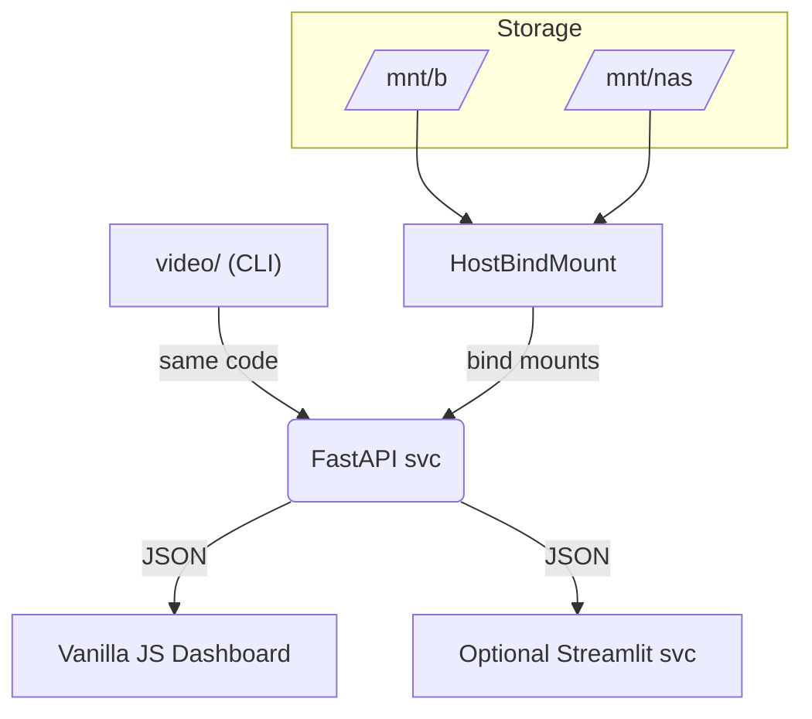

# MEDIA INDEXER 
## PYTHONISTA PROTOTYPE
### By David Cannan — Cdaprod

## Media-Indexer Bridge & DAM Toolbox -- Feature Matrix
- [x] **Sync network media → app DB**  
      _Scan NAS / SMB / cloud buckets, sync by metadata_
- [x] **Dry-run mode**  
      _Preview every operation for assurance & observability_
- [ ] **Deep media probe**  
      _Detect video-has-audio, extract frame thumbs, gather codec + EXIF_
- [x] **AI metadata enrichment**  
      _Autofill filenames, descriptions, keywords, custom fields_
- [x] **AI still-frame extractor / handler**  
      _Smart key-frame & hero-image selection_
- [x] **Audio-waveform sync**  
      _Line up multi-cam / dual-system audio via waveform analysis_
- [ ] **Speech-to-text + captions**  
      _Transcribe, delete filler words, auto-section timelines_
- [x] **Hero + Witness cam tracker export**  
      _Generate tracking data for VFX pipelines_
- [ ] **Batch media → Blender (network pass-thru)**  
      _Push shots / plates directly into Blender scenes_
- [x] **iPhone Photos ingestion**  
      _Pull & batch-rename HEIC / ProRes clips from Photos app_
- [x] **Stock-video curator**  
      _Rate, tag, and shortlist clips for licensing_
- [ ] **Dialogue / music removal**  
      _Separate stems or produce clean-dialogue tracks_
- [x] **AI batch metadata packager**  
      _Bundle enriched XML / CSV sidecars per agency specs_
- [x] **Bulk publish to stock platforms**  
      _Automate uploads & metadata mapping (e.g., Pond5, Artgrid)_
- [ ] **End-to-end media lifecycle**  
      _Capture → Edit → Publish → Archive--all tracked in one place_

---

# About the web app



- CLI & FastAPI share the same modules – you just call scan_videos() from either.
- Any UI (vanilla dashboard or Streamlit) only consumes the REST endpoints.

---

This is a logical prototype developed in Pythonista to create the pythonic math I requ ire for indexing media.


---

## Media Indexer - Pure stdlib implementation for Pythonista
Place this in: pythonista/Modules/site-packages(user)/video/

## Directory structure:

```txt
video/
├── __init__.py          # This file
├── db.py               # Database interface
├── scanner.py          # File scanning logic
├── sync.py             # Photo sync integration
└── schema.sql          # Database schema
``` 

## Usage:

```python
from video import MediaIndexer
indexer = MediaIndexer()
indexer.scan()
recent = indexer.get_recent()
```  

## Shortcuts JSON Example

### A. single step

```json
{
  "action": "backup",
  "backup_root": "/Volumes/Media/B/Video/_MASTER"
}
``` 

### B. workflow

```json
{
  "workflow": [
    {
      "action": "sync_album",
      "root": "/Volumes/Media/B/Video",
      "album": "My Album",
      "category": "edit",
      "copy": true
    },
    { "action": "scan",   "root": "/Volumes/Media/B/Video/_INCOMING" },
    { "action": "backup", "backup_root": "/Volumes/Media/B/Video/_MASTER" },
    { "action": "stats" }
  ]
}
``` 