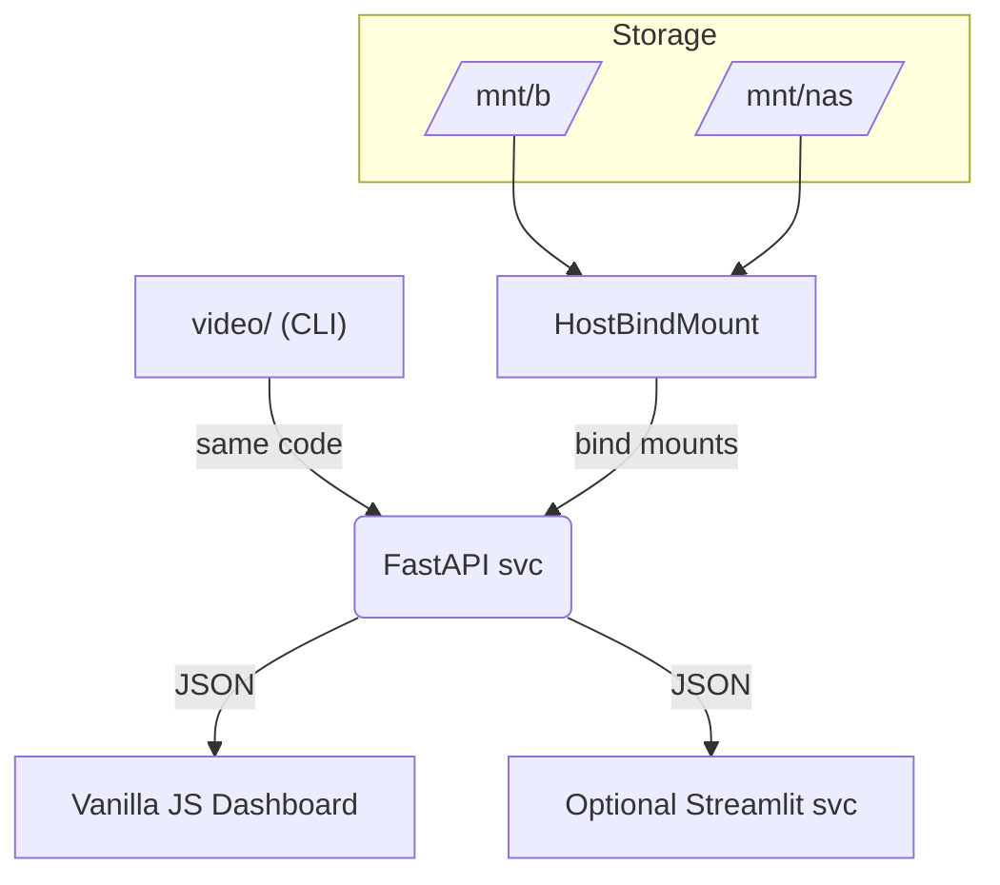

# MEDIA INDEXER 
## PYTHONISTA PROTOTYPE
### By David Cannan — Cdaprod



- CLI & FastAPI share the same modules – you just call scan_videos() from either.
- Any UI (vanilla dashboard or Streamlit) only consumes the REST endpoints.

---

This is a logical prototype developed in Pythonista to create the pythonic math I require for indexing media.

---

## Media Indexer - Pure stdlib implementation for Pythonista
Place this in: pythonista/Modules/site-packages(user)/video/

## Directory structure:

```txt
video/
├── __init__.py          # This file
├── db.py               # Database interface
├── scanner.py          # File scanning logic
├── sync.py             # Photo sync integration
└── schema.sql          # Database schema
``` 

## Usage:

```python
from video import MediaIndexer
indexer = MediaIndexer()
indexer.scan()
recent = indexer.get_recent()
```  

## Shortcuts JSON Example

### A. single step

```json
{
  "action": "backup",
  "backup_root": "/Volumes/Media/B/Video/_MASTER"
}
``` 

### B. workflow

```json
{
  "workflow": [
    {
      "action": "sync_album",
      "root": "/Volumes/Media/B/Video",
      "album": "My Album",
      "category": "edit",
      "copy": true
    },
    { "action": "scan",   "root": "/Volumes/Media/B/Video/_INCOMING" },
    { "action": "backup", "backup_root": "/Volumes/Media/B/Video/_MASTER" },
    { "action": "stats" }
  ]
}
``` 