# Media Indexer & DAM Toolbox

[](https://github.com/Cdaprod/ThatDAMToolbox/actions/workflows/ci-build-and-publish.yml)
[](https://github.com/Cdaprod/ThatDAMToolbox/actions/workflows/generate-nodeprop-config.yml)
[](https://github.com/Cdaprod/ThatDAMToolbox/actions/workflows/generate-docker-diagram.yml)
[](https://github.com/Cdaprod/ThatDAMToolbox/actions/workflows/ci-engineer-env.yml)


<div align="center">

<p>
  <a href="https://youtube.com/@Cdaprod">
    
  </a>
  <a href="https://twitter.com/cdasmktcda">
    
  </a>
  <a href="https://www.linkedin.com/in/cdasmkt">
    
  </a>
  <a href="https://github.com/Cdaprod">
    
  </a>
  <a href="https://blog.min.io/author/david-cannan">
    
  </a>
</p>

</div>

**By David Cannan (@Cdaprod)**

> **AI-Powered Digital Asset Management System**  
> Advanced media processing, hierarchical embedding generation, and intelligent content discovery for modern video workflows.

## Overview

A comprehensive Digital Asset Management (DAM) system that combines traditional media indexing with advanced AI-powered video processing. Built for content creators, video professionals, and organizations managing large media libraries.

### System Architecture

```
Browser  →  FastAPI  →  Database
              ↘︎  Worker Queue → ML Workers (AI/ffmpeg)
              ↘︎  /data Volume → Raw Media Assets
```

## Table of Contents

- [Core Features](#core-features)
- [AI Video Processing](#ai-video-processing)
- [System Architecture](#system-architecture-details)
- [Hardware Context](#hardware-context)
- [Installation](#installation)
- [Quick Start](#quick-start)
- [API Documentation](#api-documentation)
- [Development Roadmap](#development-roadmap)
- [Contributing](#contributing)
- [License](#license)

## Core Features

### 🧺 Docker Compose Service Topology

**This diagram is a high-level overview of how our three containers, their mounted volumes, and the shared network fit together:**


### Services
- video-api (FastAPI backend)
- video-web (Next.js frontend)
- video-cli (CLI utilities)
### Volumes
- Host media library:
  - /mnt/b/Video/thatdamtoolbox → /data
  - /mnt/b/Video/_INCOMING → /data/_INCOMING
  - Local project video folder: ./video → /video
### Frontend code & build output:
  - ./docker/web-app → /app
  - /app/node_modules & /app/.next for runtime dependencies
- Database WAL store for CLI: db_wal → /var/lib/thatdamtoolbox/db
### Network
- All three services attach to the damnet bridge network for internal communication.
- The frontend (video-web) also connects to video-api over its published ports.

This topology ensures that each container has direct, read-write access to the same media directories, while isolating inter-service traffic on a dedicated Docker network.

---

### ✨ AI-Powered Media Processing

- **Hierarchical Video Embeddings**: Multi-layer (L0-L3) vector representations
- **Intelligent Content Discovery**: Semantic search across video libraries
- **Automated Metadata Enrichment**: AI-generated descriptions, tags, and classifications
- **Smart Frame Extraction**: Automatic key-frame and hero-image selection

### 🎬 Professional Video Workflows

- **Multi-Camera Sync**: Audio waveform analysis for perfect alignment
- **Motion Detection & Tracking**: Advanced computer vision capabilities
- **Speech-to-Text Processing**: Automated transcription with timeline sections
- **Blender Integration**: Direct pipeline to 3D workflows

### 🔄 Content Management

- **Batch Processing**: Efficient handling of large media collections
- **Network Sync**: SMB/NAS integration with metadata preservation
- **Stock Platform Publishing**: Automated uploads to licensing platforms
- **iPhone Photos Integration**: Seamless HEIC/ProRes import workflows

---

## AI Video Processing

### Hierarchical Embedding System

The core innovation of this DAM system is its multi-level video understanding:

```mermaid
sequenceDiagram
    participant UI as Browser
    participant JS as app.js
    participant Scan as BatchScanner
    participant API as /video.server (FastAPI)
    participant DAM as /api/embedding router
    participant Store as VectorStorage

    Note over UI,JS: User drops a folder into web UI
    JS->>Scan: POST /scan?dir=/media/batch1
    Scan->>Scan: Walk dir, find foo.mp4
    Scan->>API: POST /api/embedding/videos/ingest {path:"/media/batch1/foo.mp4"}
    API->>DAM: forward call
    DAM->>Store: store L0 vector
    DAM-->>API: {uuid:"abcd-1234", levels:{L0:1}}
    API-->>Scan: 200 OK
    Note right of DAM: background task<br/>generates L1–L3
```



### Processing Levels

- **L0**: Raw video ingestion and basic metadata
- **L1**: Frame-level analysis and feature extraction
- **L2**: Scene segmentation and content understanding
- **L3**: Semantic relationships and cross-video connections

---

## System Architecture Details

### Application Stack


---

### API Endpoints


The FastAPI server provides comprehensive REST endpoints:

- `/motion/extract` - Motion Detection & Analysis
- `/scan` - File Discovery & Indexing
- `/search` - Content Search & Filtering
- `/batches` - Batch Processing Management
- `/backup` - Backup Operations
- `/sync_album` - Album Synchronization
- `/paths` - Path Management
- `/jobs` - Job Monitoring & Status

--- 

## Hardware Context

### Device Integration Matrix

The system integrates with various hardware and virtual devices for optimal performance:


---

## Architecture Overview

This system provides a multi-layered video processing architecture with clean service boundaries. The **api-gateway** serves as the main entry point, handling all client traffic and proxying to backend services. Host-level services like **camera-proxy** provide device virtualization (exposing cameras to containers without mounts), while **capture-daemon** handles continuous FFmpeg recording. The **pipeline-manager** enables advanced video processing through virtual devices and named pipes.

All services share common middleware for authentication, rate limiting, logging, and caching. The architecture separates concerns cleanly: gateway handles routing and middleware, proxy services manage device access, and capture services handle media processing—all while keeping containers device-agnostic.

### System Flow


⸻

## How the Flow Works
### End-to-End Flow Example:


⸻

#### DevOps & Composability
- Each service can be run as a standalone systemd service or orchestrated in a minimal Compose/Podman/Docker Compose stack. You do not need to bind-mount devices into your containers.
- Infra upgrades, extensions, and migration: Drop-in additional pipeline processors, swap out middlewares, and swap from POC to production ready by extending only the parts you care about.
- Frontends can remain "dumb" and make fetch calls to the same endpoints (the API gateway abstracts everything).

⸻

#### How to Extend or Productionize
- Security: Harden JWT, implement real validateJWT, remove dev-mode CORS and CheckOrigin: true.
- Monitoring: Add metrics middleware, Prometheus endpoints, journal logs, proper log rotation.
- Error handling: Ensure all device errors are surfaced through API/WS responses, not just logs.
- Config management: Use .env files, config maps, or secrets for all paths, keys, intervals.
- Add tests: System/integration/e2e tests per service.
- API Versioning: Add /v1/ routes for long-term contract stability.
- Modular runners: Each camera runner could push frames to a message bus (NATS, MQTT, etc.) for plug-and-play downstream processing (AI, cloud upload, etc).


---

## Installation

### Prerequisites

- Python 3.8+
- Docker (recommended)
- FFmpeg
- CUDA-capable GPU (optional, for AI acceleration)

### Docker Setup (Recommended)

```bash
# Clone the repository
git clone https://github.com/Cdaprod/ThatDAMToolbox.git
cd ThatDAMToolbox

# Build and run with Docker Compose
docker-compose up -d

# Access the web interface
open http://localhost:8080
```

### Manual Installation

```bash
# Install dependencies
pip install -r requirements.txt

# Initialize database
python -m video.db init

# Start the server
uvicorn video.server:app —host 0.0.0.0 —port 8080
```

## Quick Start

### Basic Usage

```python
from video import MediaIndexer

# Initialize the indexer
indexer = MediaIndexer()

# Scan a directory
indexer.scan("/path/to/media")

# Get recent files
recent_media = indexer.get_recent()

# Search content
results = indexer.search("sunset beach")
```

### Web Interface

1. Navigate to `http://localhost:8080`
1. Drop media files or folders onto the interface
1. Monitor processing progress in real-time
1. Search and explore your indexed content

### Workflow Automation

Create JSON workflows for complex operations:

```json
{
  "workflow": [
    {
      "action": "sync_album",
      "root": "/media/workspace",
      "album": "Project Alpha",
      "category": "edit",
      "copy": true
    },
    { "action": "scan", "root": "/media/incoming" },
    { "action": "backup", "backup_root": "/media/archive" },
    { "action": "stats" }
  ]
}
```

## API Documentation

### Core Endpoints

#### Scan Media Directory

```http
POST /scan?dir=/path/to/media
```

#### Ingest Video for AI Processing

```http
POST /api/embedding/videos/ingest
Content-Type: application/json

{
  "path": "/media/video.mp4",
  "generate_levels": ["L1", "L2", "L3"]
}
```

#### Search Content

```http
GET /search?q=sunset+beach&type=video
```

#### Get Processing Status

```http
GET /jobs/{job_id}/status
```

## Development Roadmap

### Current Progress

#### ✅ Completed

- [x] **Hierarchical Video Embedding System** - Multi-layer AI processing
- [x] **Hero + Witness Cam Tracker Export** - VFX pipeline integration
- [x] **iPhone Photos Ingestion** - HEIC/ProRes batch processing
- [x] **Stock Video Curation** - Rating and licensing workflows
- [x] **AI Batch Metadata Packaging** - XML/CSV sidecar generation
- [x] **Bulk Stock Platform Publishing** - Automated distribution

#### 🚧 In Progress

- [ ] **Abstract Base Models & Artifact Factory** - Domain modeling framework
- [ ] **Vanilla Frontend Browser API** - Card-based web interface
- [ ] **Next.js Frontend** - Production Ready Web Browser App
- [ ] **Network Media Sync** - SMB/NAS/cloud integration
- [ ] **Deep Media Probe** - Advanced codec and EXIF analysis 
- [ ] **Websocket + WebRTC** - Frontend implmentation
- [ ] **Realtime Overlays** - False Color, Zebras, Focus Peaking
- [ ] **Monitor Multiple Cameras** - Indexes devices & hot plug/swap persistent
- [ ] **Web App Video Results** - Mjpeg preview of feeds in browser api endpoint 
#### 📋 Planned

- [ ] **Audio-Waveform Sync** - Multi-cam align ent
- [ ] **Speech-to-Text + Captions * - Advanced transcription
- [ ] **Batch Media → Blender Integration** - Dire t scene injection
- [ ] **Dialogue/Music Separation** - AI-powere  audio processing
- [ ] **End-to-End Media Lifecycle** - Comp ete workflow automation

## Directory Structure

```
vid o/
├── __init__.py          # Main module
├── db.py           x   # Database in erfxce
├── scanner.py          # Fil  scanning logic  
├── sync.py             # Photo sync integrati n
├── schema.sql          # Database schema
├── web/               # Web interf ce
│   ├── static/        # CSS, JS, assets
│   └── templates/     # HTML templates
├── api/      x        # API modules
│   ├── embedding/     # AI p ocessing
│   └── motion/        # Computer vision
└── worker /           # Background processors
```

## Contributing

We welcomexcontributions! Please see our [Contributing Guidelines](CONTRIBUT NG.md) for details.

### Development Setup

```bash
# Fork and clone the repository
git clone https://github.com/yourusername/ThatDAMToolbox.git

# Create development environment
python -m venv venv
source venv/bin/activate

# Install development dependencies
pip install -r requirements-dev.txt

# Run tests
pytest tests/

# Start development server
uvicorn video.server:app --reload
```

## License

This project is licensed under the MIT License - see the <LICENSE> file for details.

-----

<div align="center">

**Built with ❤️ by [David Cannan](https://github.com/Cdaprod)**

*Transforming how we discover, process, and manage digital media through AI*

</div>