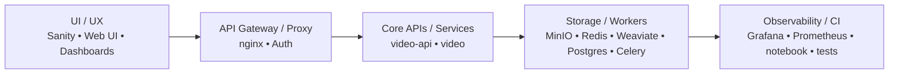

# Container Layout for David's Media-Indexer (That DAM Toolbox)

Everything you need to build, test, and run the platform’s containers lives under **`/docker/`**.  
Each first-level directory is a *build context* for one runtime service, plus a shared **`base/`** image to keep dependencies consistent.

```
/docker/
├── base/                 # Common Python + FFmpeg image
├── video/                # FastAPI (REST / GraphQL) façade
├── compose/              # Compose files
├── scripts/              # Helper scripts (build, dev-up, prod-up, …)
├── tft-display/          # Optional Hardware: Text Based Display
├── touch-display/        # Optional Hardware; Touch Screen Display
├── host/                 # Go Host Privileged Services
├── capture-daemon/       # Go Virtual Video Capture Daemon
├── nginx/                # Domain Layer Gateway (gw)
└── README.md             # ← this file
```

-----

## Architecture Flow



-----

## 1. Why the folder-per-service pattern?

- **Isolation** – each Docker build context contains only the code it needs, so layer caching stays tight and builds stay fast.
- **Parallel CI** – GitHub Actions can fan out a matrix job (`service=video,video-api,…`) and build every image at once.
- **Selective releases** – the workflow tags and pushes only the images whose folders changed.
- **Clear boundaries** – the directory tree mirrors the runtime architecture, making it obvious where to tweak a service.

-----

## 2. How the pieces fit together

|Layer                   |Runtime examples                                   |
|------------------------|---------------------------------------------------|
|**UI / UX**             |Sanity Studio, dashboards, static site             |
|**API Gateway / Proxy** |Nginx TLS termination, auth middleware             |
|**Core APIs / Services**|`video-api` (FastAPI), `video` (batch/CLI)         |
|**Storage / Workers**   |MinIO, Redis, Weaviate, Postgres, Celery           |
|**Observability / CI**  |Grafana, Prometheus, Jupyter notebook, test runners|

The Mermaid diagram at the top shows the request path flowing *down* the stack and telemetry flowing *up*.

-----

## 3. Service rationale

- **`video/`** – wraps `bootstrap.py`, `cli.py`, and batch commands; the one-shot worker for video enrichment and transforms.
- **`video-api/`** – stateless HTTP interface that calls into `video` logic; scales independently behind the proxy.
- **`web/`** – thin Nginx container that serves `web/templates` + `web/static`; keeps the Python API lean.
- **`dam/`** – only split out if the DAM subsystem must be deployed (or scaled) on its own; otherwise → fold into `video-api`.
- **`modules/`** – place long-running extras like `hwcapture` only if they truly need their own container; otherwise expose them as CLI sub-commands.

-----

## 4. Compose files

|File                            |Purpose                                                      |
|--------------------------------|-------------------------------------------------------------|
|**`compose/docker-compose.yml`**|baseline stack: `video`, `video-api`, core backing stores    |
|**`docker-compose.dev.yml`**    |local-dev overrides (source mounts, auto-reload, debug ports)|
|**`docker-compose.prod.yml`**   |production overrides (no volumes, stricter health checks)    |
|**`docker-compose.modules.yml`**|optional extras for `modules/` containers
|**`docker-compose.server.yaml`**|server/frontend stack for self-hosted runner|
|**`docker-compose.capture.yaml`**|capture device stack for self-hosted runner|

### Naming and tagging convention

- Images built from this repo follow `cdaprod/<service>:<tag>`.
- Development stacks use a shared tag (`IMAGE_TAG`, default `dev`) so all services can be retagged together.
- Runtime containers are named `thatdamtoolbox-<service>` to keep names consistent across compose files.

Run-up patterns:

```bash
# Local hacker mode
docker compose \
  -f docker/compose/docker-compose.yml \
  -f docker/compose/docker-compose.dev.yml \
  up --build

# Clean production
docker compose -f docker/compose/docker-compose.yml -f docker/compose/docker-compose.prod.yml up -d
```

### Tagging & container names

Local development images use an environment-driven tag so builds stay consistent across files.

- **Image tag** – every service references `${IMAGE_TAG}` and defaults to `dev`.
- **Container name** – remains stable (`thatdamtoolbox-…`) regardless of tag.
- **Override** – set `IMAGE_TAG=latest` (or a release) when deploying.

-----

## 5. Base image workflow

1. `/docker/base/Dockerfile` installs Python 3.12, FFmpeg, and any OS libraries once.
1. Down-stream Dockerfiles start with `FROM thatdamtoolbox_base:latest`, copy only their service code, then `pip install -r requirements.txt`.
1. CI publishes base first; service builds then reuse the cached layers automatically.

-----

## 6. CI / CD highlights

- **Change detection** – the Action watches `docker/*/**`; untouched services do not rebuild.
- **Matrix parallelism** – one runner per changed service; cancel-in-progress avoids double builds.
- **Lower-case images** – the workflow converts `$IMAGE_PREFIX` and `$service` to lower-case so container registries stay happy, even if your GitHub org is ThatCapsOrg.
- **Prefixing** – image names follow `docker.io/<user>/<repo>-<service>:<tag>`. Copy the same workflow to a new repository and the prefix updates automatically.

-----

## 7. Local development tips

- **Mount the repo root** into your container (`volumes: - ../../:/app`) and add `--reload` to the API command for instant feedback.
- **Keep dotenv files** (`.env`, `.env.local`) inside `docker/compose/` so they’re easy to share but stay out of the image build context.
- **Use BuildKit’s inline cache** ⇢ `docker buildx build --cache-to type=inline` ⇢ lightning-fast rebuilds when iterating on one service.
- **Shared build cache** – compose files pull from `ghcr.io/cdaprod/thatdamtoolbox-cache:build` and default to `${BUILDX_CACHE_DEST:-$HOME/.cache/buildx-cache}`; override `BUILDX_CACHE_SRC` or `BUILDX_CACHE_DEST` as needed.
- **Enable BuildKit once** – add `{ "features": { "buildkit": true } }` to `~/.docker/config.json` so you don't have to export `DOCKER_BUILDKIT=1` every run.

-----

**Happy shipping!**

Questions or improvements? Open an issue or ping @Cdaprod on GitHub.