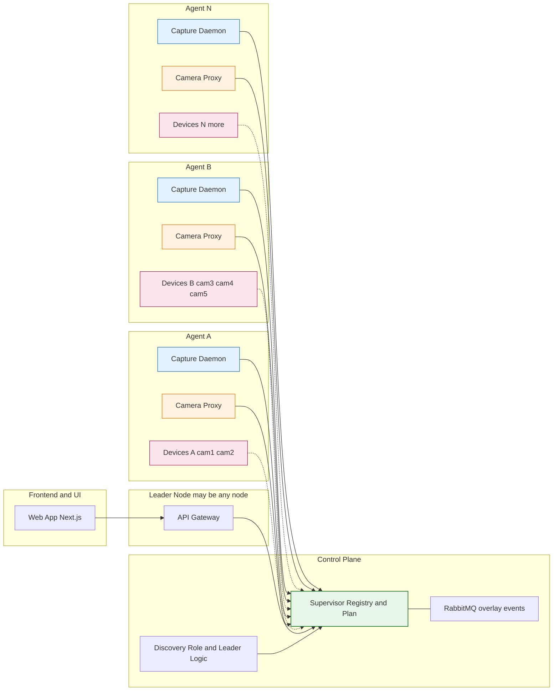
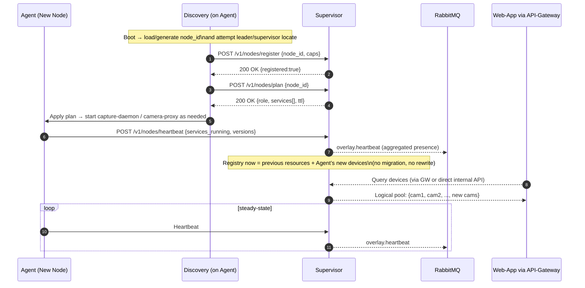

## Horizonal Scaling Overview

```mermaid
graph LR

  %% Control plane
  subgraph Control_Plane [Control Plane]
    SUP["Supervisor Registry and Plan"]
    DISC["Discovery Role and Leader Logic"]
    MQ["RabbitMQ overlay events"]
  end

  %% Frontend
  subgraph Frontend [Frontend and UI]
    WEB["Web App Next.js"]
  end

  %% Leader node
  subgraph Leader_Node [Leader Node may be any node]
    GW["API Gateway"]
  end

  %% Agents
  subgraph Agent_A [Agent A]
    CDA["Capture Daemon"]
    CPA["Camera Proxy"]
    DA["Devices A cam1 cam2"]
  end

  subgraph Agent_B [Agent B]
    CDB["Capture Daemon"]
    CPB["Camera Proxy"]
    DB["Devices B cam3 cam4 cam5"]
  end

  subgraph Agent_N [Agent N]
    CDN["Capture Daemon"]
    CPN["Camera Proxy"]
    DN["Devices N more"]
  end

  %% Wiring
  SUP --- MQ
  DISC --> SUP

  CDA --> SUP
  CPA --> SUP
  CDB --> SUP
  CPB --> SUP
  CDN --> SUP
  CPN --> SUP

  DA -.-> SUP
  DB -.-> SUP
  DN -.-> SUP

  WEB --> GW
  GW --> SUP

  %% Styling (safe minimal)
  style SUP fill:#e8f5e9,stroke:#2e7d32,stroke-width:1.5px
  style CDA fill:#e3f2fd,stroke:#1565c0
  style CDB fill:#e3f2fd,stroke:#1565c0
  style CDN fill:#e3f2fd,stroke:#1565c0
  style CPA fill:#fff3e0,stroke:#ef6c00
  style CPB fill:#fff3e0,stroke:#ef6c00
  style CPN fill:#fff3e0,stroke:#ef6c00
  style DA fill:#fce4ec,stroke:#ad1457
  style DB fill:#fce4ec,stroke:#ad1457
  style DN fill:#fce4ec,stroke:#ad1457
```  

## Horizonal Scaling Join Sequence

```mermaid
sequenceDiagram
    autonumber
    participant A as Agent (New Node)
    participant D as Discovery (on Agent)
    participant S as Supervisor
    participant MQ as RabbitMQ
    participant UI as Web-App via API-Gateway

    Note over D: Boot → load/generate node_id\nand attempt leader/supervisor locate
    D->>S: POST /v1/nodes/register {node_id, caps}
    S-->>D: 200 OK {registered:true}
    D->>S: POST /v1/nodes/plan {node_id}
    S-->>D: 200 OK {role, services[], ttl}

    D->>A: Apply plan → start capture-daemon / camera-proxy as needed
    A->>S: POST /v1/nodes/heartbeat {services_running, versions}
    S-->>MQ: overlay.heartbeat (aggregated presence)

    Note over S: Registry now = previous resources + Agent’s new devices\n(no migration, no rewrite)
    UI-->>S: Query devices (via GW or direct internal API)
    S-->>UI: Logical pool: {cam1, cam2, ..., new cams}

    loop steady-state
        A->>S: Heartbeat
        S-->>MQ: overlay.heartbeat
    end
``` 