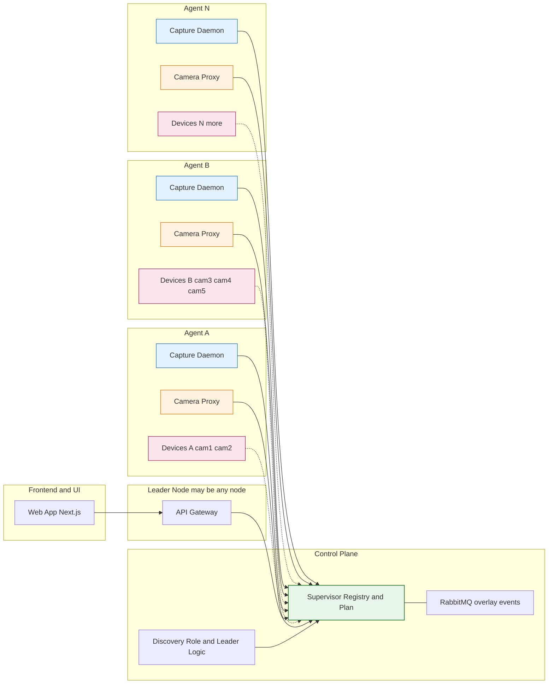
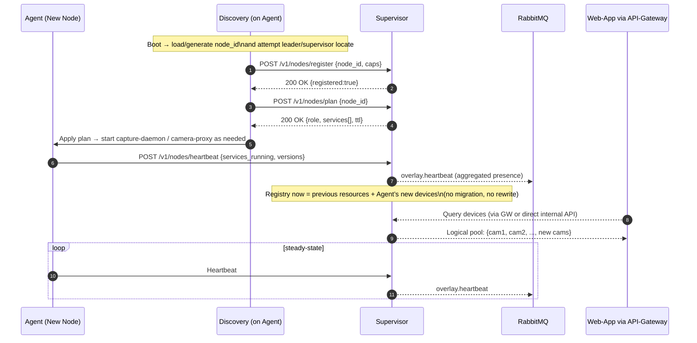

## Horizonal Scaling Overview

## Horizonal Scaling Join Sequence

Once we have that how do we implement them all with existing codebase and proceed to wire it so our specific needs are met as far as bootstrapping (so we can go back and observe video-api bootstrapping and write it into golang… so we have agent => supervisor => etc… bootstrapping one primary control plane for every added structured environment, we already have leader node does that need to be better factored to fit this too? 

Also I have wondered for a while now say were in prod deployed on multiple devices like a laptop, raspberry pi 5, raspberry pi zero w2, and a desktop PC… how do we handle if we’re first ran on a basic capture devices like the rpi5… and we bootstrap our control plane and leader node, and then we later deploy on the desktop computer… how do we self heal the fact that we are not relying on the best resources available? 

If a better candidate becomes an available… should we or how do we then migrate to that or at least how do we 

Love where you’re taking this. Here’s a crisp, do-this-next plan that plugs into your current tree without rewrites, makes bootstrapping control-plane-oriented, and adds resource-aware leader migration so clusters "self-upgrade" when a better box arrives (e.g., desktop shows up after an rpi5).

⸻

1) Wire bootstrapping into the existing codebase

A. Supervisor publishes Desired State (plan + environment)
	•	Where:
/host/services/supervisor/cmd/supervisor/
/host/services/supervisor/internal/reconcile/…
/host/services/supervisor/internal/ports/… (from the spec you accepted)
	•	Add endpoints (stubs OK first):
/v1/nodes/register · /v1/nodes/plan · /v1/nodes/heartbeat
/v1/bootstrap/profile · /v1/bootstrap/status · /v1/bootstrap/events
	•	Responsibility: compute a plan per node (role + services) and serve the EnvironmentProfile for reconcilers (storage/broker/index). Keep it idempotent and non-destructive by default.

B. Discovery becomes the applier (per-node)
	•	Where: /host/services/discovery/
	•	Add handshake loop:
	1.	Identify → 2) Locate control plane → 3) Register → 4) Get plan → 5) Apply (start/stop services; write cluster.json) → 6) Heartbeat → 7) Reconcile environment (storage → broker → index).
	•	Important: discovery should not create global state from Python anymore. It calls supervisor for profile and runs reconcilers (via ports/adapters).
	•	Use your shared libs:
	•	Logging: /host/services/shared/logx/
	•	Bus: /host/services/shared/bus/
	•	(Optional) QUIC later, unchanged API.

C. Services become self-scoped
	•	video-api only runs its own DB/schema/module bootstrap and emits readiness; no more cluster-wide bucket/exchange/schema init.
	•	capture-daemon & camera-proxy just expose health & features.

⸻

2) Pull Python bootstrapping into Go (without losing features)

Your FastAPI "environment bootstrapper" becomes data (profile), not "the place that runs scripts."
	•	Extract its intentions (buckets/exchanges/index classes) into the EnvironmentProfile document.
	•	Implement reconcilers in Go (storage/broker/index) behind ports.
	•	Keep Python for media domain logic (embeddings, artifacts, pipelines). It still runs its local migrations, but global setup is now done by discovery according to supervisor’s desired state.

Result: one source of truth (Supervisor), one applier per node (Discovery), services just start.

⸻

3) Resource-aware leader election (upgrade to the "best box")

Today: first leader wins.
Goal: if a better candidate appears later (e.g., desktop), promote it safely.

A. Report capabilities
	•	Discovery → Supervisor adds caps:
cpu_cores, cpu_mips (or model), ram_mb, disk_iops_hint, net_mbps_est, gpu={cuda,opencl,none}, arch, thermal_headroom, uptime, device_count, role_eligibility (can host gateway/supervisor/broker/index).
	•	Where: extend your payload in /v1/nodes/register and heartbeat.

B. Score leaders
	•	Supervisor calculates a LeaderScore(node) from caps:

score = w_cpu*norm(cpu_cores) +
        w_ram*norm(ram_mb) +
        w_net*norm(net_mbps_est) +
        w_disk*norm(disk_iops_hint) +
        w_gpu*flag(gpu) +
        w_therm*norm(thermal_headroom) +
        w_uptime*norm(uptime) +
        w_devices*norm(device_count) +
        penalties (battery_only?, therm_throttled?)

	•	Keep weights in config; expose current scores at /v1/leader/candidates.

C. Lease + hysteresis (avoid flapping)
	•	Leader has a lease (epoch, TTL).
	•	Re-eval cadence: e.g., every 5–10 minutes.
	•	Promotion rule: new candidate must beat current leader by Δ ≥ threshold (say 20%) for K consecutive checks (say 3) to promote.
	•	Stickiness: don’t demote unless you really should.

D. Safe handover (zero/low downtime)

When promotion triggers:
	1.	Prepare: mark new node’s plan → include api-gateway, supervisor (if you want HA, you can run 2ndary in warm-standby before cutover).
	2.	Sync state: copy in-memory registries to the newcomer (or let them reconstruct from heartbeats); persist EnvironmentProfile in Supervisor (already there).
	3.	Advertise: update mDNS SRV to point to the new control plane URL; emit overlay.leader event with new epoch.
	4.	Flip plan: Supervisor updates all nodes’ control_plane_url in /v1/nodes/plan.
	5.	Drain: old leader stops admitting new control-plane sessions, continues proxying until grace period ends, then demotes.
	6.	Finalize: bump epoch; discovery loops apply the new plan; agents reconnect to the new leader via mDNS/plan.

You already publish to RabbitMQ; use it to broadcast overlay.plan and overlay.leader so UIs and agents switch quickly.

What moves?
	•	Control-plane services (api-gateway, supervisor, optionally "infra" if you host broker/index/storage on leader).
	•	Capture stays where the devices are -- you’re not migrating cameras, just the brain.

⸻

4) Mixed hardware reality (rpi5 → desktop shows up later)

First boot on rpi5:
	•	rpi5 self-elects leader, runs control plane, minimal profile gets applied, cluster works.

Later desktop joins:
	•	Desktop registers with high score.
	•	Supervisor’s next evaluation sees Δ > threshold for K intervals → triggers handover.
	•	Discovery on desktop receives plan with leader services → starts them.
	•	mDNS & /v1/nodes/plan flip → all agents drift to the stronger leader automatically.
	•	Old rpi5 demotes to worker (still capturing its local cameras).
	•	Net effect: self-healed to best resources without manual intervention.

If desktop goes away:
	•	Lease expires → next best candidate wins; same flow in reverse.
	•	Because discovery is idempotent, nodes keep running last good plan until new leader appears.

⸻

5) Concrete integration steps (in your tree)
	1.	Supervisor: add scoring & leader CAS
	•	/host/services/supervisor/cmd/supervisor/leader.go
	•	store candidates, compute LeaderScore, hold lease (epoch, TTL), hysteresis counters.
	•	/v1/leader/claim, /v1/leader/candidates, /v1/leader (read).
	2.	Supervisor: desired plan per node
	•	/v1/nodes/plan returns {role, services[], control_plane_url, gateway_url, epoch, ttl} based on:
	•	current leader lease,
	•	node role eligibility,
	•	service placement policy (e.g., only leader runs api-gateway/supervisor).
	3.	Discovery: handshake + applier
	•	/host/services/discovery/handshake.go runs the FSM you accepted (register → plan → apply → heartbeat).
	•	Reads plan → starts/stops compose services locally (or binary targets) based on role.
	•	Calls reconcilers for storage/broker/index using ports (defaults if externals absent).
	4.	Environment reconcilers (idempotent)
	•	/host/services/supervisor/internal/reconcile/{storage,broker,index}_reconciler.go
	•	Backed by adapters in /internal/adapters/… (FS/in-proc/in-mem by default; MinIO/RabbitMQ/Weaviate when env present).
	•	Emit overlay.bootstrap.* events.
	5.	video-api: scope down
	•	Ensure it only performs service-local migrations & module init.
	•	Remove global bucket/exchange/schema creation; let discovery/supervisor own it.
	6.	mDNS & cutover
	•	Leader advertises _thatdam._tcp.local with SRV/TXT (role=leader, epoch).
	•	Discovery prefers mDNS leader URL; plan overrides win when present.
	7.	Observability
	•	Web-app page reading /v1/leader, /v1/leader/candidates, /v1/nodes/plan, and bootstrap status to show: who’s leader, why, what’s running where, last reconcile.

⸻

6) Policy knobs (you’ll want these)
	•	LEADER_PROMOTION_THRESHOLD (Δ score, default 0.2)
	•	LEADER_PROMOTION_STABILITY (K consecutive intervals, default 3)
	•	LEADER_LEASE_TTL (default 45s)
	•	PLAN_REFRESH_INTERVAL (default 30–60s)
	•	Per-capability weights (w_cpu, w_ram, w_gpu, …) in Supervisor config.
	•	"Role eligibility" flags (e.g., don’t ever host control plane on battery-only nodes).

⸻

7) No-Docker / low-priv nodes

Discovery decides container vs binary:
	•	If Docker/containerd/podman present → run images.
	•	Else use static binaries (your reconcile & start/stop logic supports both).
	•	On upgrade: agents fetch artifacts from LAN (Supervisor or MinIO).
	•	Same plan, different runner -- still idempotent.

⸻

TL;DR wiring order (do this now)
	1.	Add Supervisor plan + profile endpoints and leader scoring with lease/hysteresis.
	2.	Add Discovery handshake + plan applier, using ports/adapters for reconcilers.
	3.	Move Python global bootstrap → EnvironmentProfile; keep only service-local init in video-api.
	4.	Implement safe leader handover flow (prepare → advertise → flip plan → drain → demote).
	5.	Turn on mDNS advertise/browse and show leader in web-app.

You’ll then have: agent → supervisor → plan → discovery applies, with resource-aware, self-healing leadership and idempotent environment bootstrap -- across rpi5 → desktop → whatever shows up next.