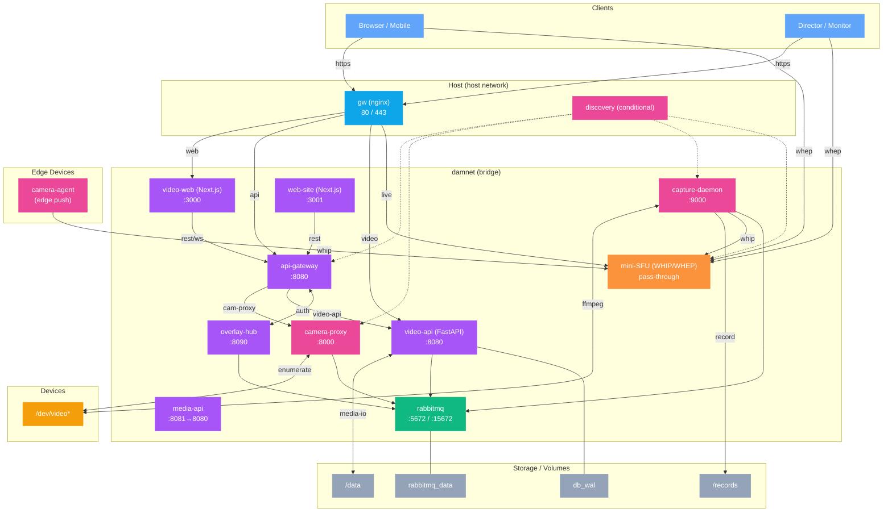
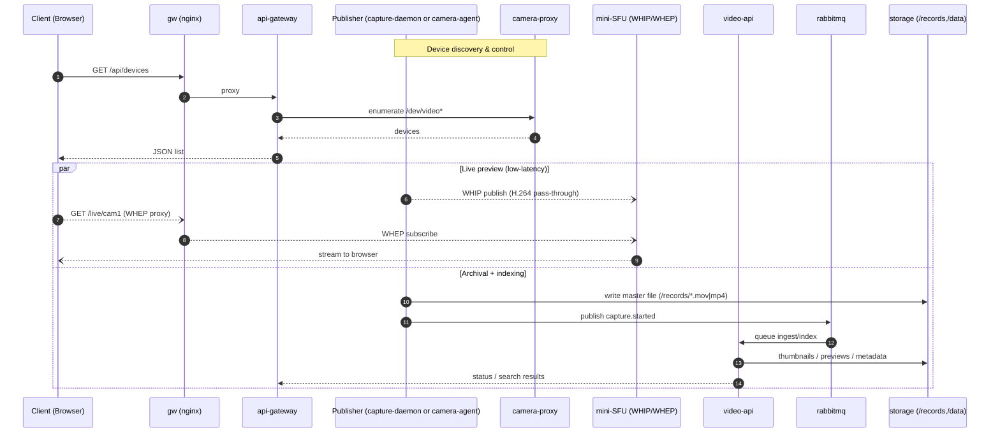

# SERVICES

## Service Topology (Docker/Host)

## Live Preview / Capture Request (Sequence)

Tip: in Freeform, paste the code blocks as text to keep them editable; render in your README or docs site where Mermaid is supported.