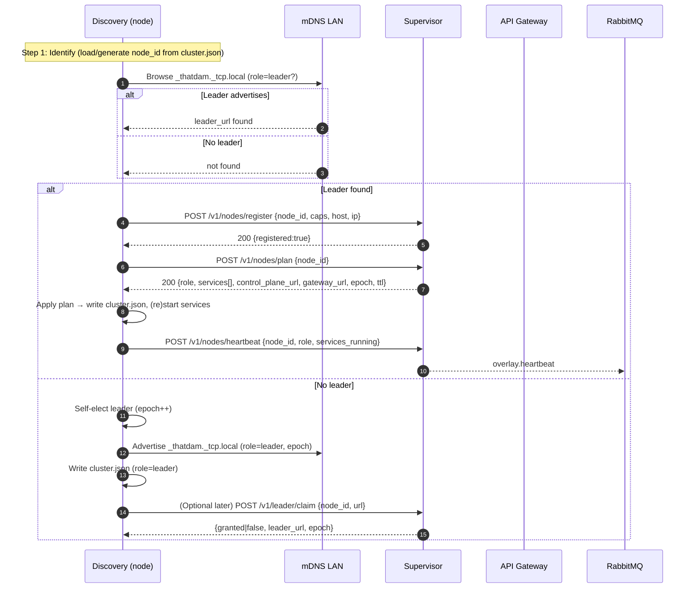

# Discovery ↔ Supervisor Handshake

**Goal:** Let any node boot the same stack and decide its role at runtime. Discovery prefers a Supervisor-led plan; if none is reachable, it self-elects and advertises.

## Transport & Auth
- Transport: HTTP/1.1 (upgradeable to HTTP/3/QUIC later; same routes/payloads).
- Auth: Dev → `X-API-Key`; Prod → `Authorization: Bearer <JWT>` (JWKS via api-gateway).

## High-Level Flow
1. **Identify**: Discovery loads/creates `cluster.json` (`node_id`, optional `leader_url`, optional `role`).
2. **Locate control plane**: Try mDNS `_thatdam._tcp.local` → `CLOUD_CONTROL_URL` → optional Tailscale hint.
3. **Register**: POST `/v1/nodes/register` with `node_id`, capabilities, host/ip, sw versions.
4. **Plan**: POST `/v1/nodes/plan` to get `{role, services[], control_plane_url, gateway_url, epoch, ttl_seconds}`.
5. **Apply**: Write `cluster.json` atomically; start/stop local services to match `services[]`.
6. **Heartbeat**: POST `/v1/nodes/heartbeat` every `ttl/3` seconds with current status.
7. **Change detection**: Poll `/v1/nodes/plan` or subscribe to `overlay.plan` (AMQP) and re-apply as needed.

## Self-Election (No Supervisor Found)
- Discovery sets `role=leader`, increments `epoch`, advertises mDNS (`role=leader`, `epoch`).
- When a Supervisor later appears, Discovery registers and attempts `/v1/leader/claim`.
- If claim denied, Discovery demotes to worker and rewrites `cluster.json`.

## Minimal Supervisor API (Contract)
- `POST /v1/nodes/register` → upsert node presence; emits `overlay.register`.
- `POST /v1/nodes/plan` → returns desired `{role, services[], control_plane_url, gateway_url, epoch, ttl_seconds}`.
- `POST /v1/nodes/heartbeat` → refresh TTL; emits `overlay.heartbeat`.
- `POST /v1/leader/claim` → CAS leadership; returns `{granted, leader_url, epoch}`.
- `GET  /v1/leader` → current leader URL and epoch (or 404).

## Events (AMQP)
- `overlay.register`  `{ node_id, caps, ts }`
- `overlay.heartbeat` `{ node_id, role, services_running, versions, ts }`
- `overlay.plan`      `{ node_id, role, services[], epoch, ts }`
- `overlay.leader`    `{ leader_url, epoch, ts }`

## Timeouts & TTLs
- Heartbeat interval: `ttl_seconds / 3` (e.g., 15s if TTL=45s).
- Mark `stale` if no heartbeat for `ttl_seconds`.
- Consider leader `dead` after `3 * ttl_seconds` → next claim wins CAS.

## Air-Gapped
- `control_plane_url` and artifact URLs must be LAN-local (Supervisor or local MinIO/NFS).
- Agents never fetch from the public internet.

---

## Sequence (Discovery-led boot)

