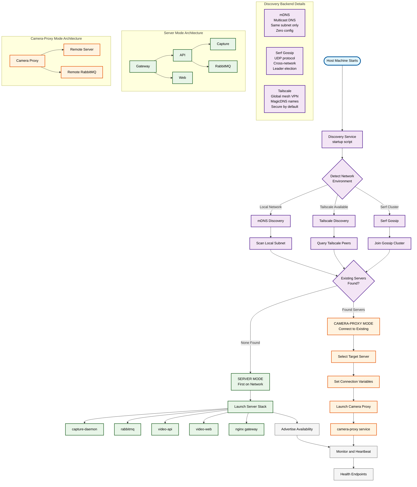

# ThatDAM Hybrid Discovery Service

🚀 **Enterprise-grade auto-discovery for PaaS/IaaS/SaaS deployment**

This discovery service intelligently determines whether to become a “central server” (running capture-daemon + all infrastructure) or a “camera-proxy” (connecting to existing server) based on network environment discovery.

### Requirements

- Docker Compose v2 (`docker-compose` or `docker compose` plugin) is required to launch the server stack.
- To run without Docker Compose, force proxy mode by setting `ROLE=agent` or starting the binary with `--role agent`.

### Development

```bash
# run service
go run ./cmd/discovery

# run tests
go test ./...
```


### Logging

The service uses a shared logger configured via environment variables:

- `LOG_LEVEL` – debug|info|warn|error (default info)
- `LOG_FORMAT` – auto|json|text (default auto)
- `LOG_CALLER` – off|short|full (default short)
- `LOG_TIME` – off|rfc3339|rfc3339ms (default rfc3339ms)
- `LOG_NO_COLOR` – set to `1` to disable colored output

## 🎯 What This Solves

**Current Problem:**

- ❌ All machines run the full `docker-compose.yaml` stack
- ❌ Manual coordination needed between hosts
- ❌ Hard-coded hostnames/IPs required

**Solution:**

- ✅ Single executable that auto-discovers environment
- ✅ Systematic delegation: server vs camera-proxy mode
- ✅ Zero-configuration deployment across local networks and hybrid cloud

---

## 📁 Project Integration

### Discovery Architecture

## 🎨 **Visual Design**

- **Color-coded** by function (discovery=purple, server=green, proxy=orange)
- **Flow arrows** show the decision path
- **Service details** show ports and key features
- **Subgraphs** organize related components



This Mermaid diagram illustrates the complete flow of your hybrid discovery system. Here’s what it shows:

## 🎯 **Diagram Breakdown**

### **Discovery Flow (Top Section)**

1. **Single Entry Point:** `./startup.sh start` on any machine
1. **Environment Detection:** Auto-detects available discovery backends
1. **Network Scanning:** Uses mDNS, Serf, or Tailscale to find existing servers
1. **Intelligent Decision:** Determines server vs proxy mode based on discoveries

### **Mode Architecture (Bottom Subgraphs)**

- **Server Mode:** Shows full infrastructure stack (capture-daemon, rabbitmq, apis, web, gateway)
- **Proxy Mode:** Shows lightweight camera-proxy connecting to discovered remote server

### **Discovery Methods (Left Subgraph)**

Details the three discovery backends with their characteristics:

- **mDNS:** Local network, zero-config
- **Serf:** Cross-network gossip protocol
- **Tailscale:** Global mesh with MagicDNS

--- 

### 1. Directory Structure

Add these files to your existing project:

```
your-project/
├── host/services/discovery/          # New discovery service
│   ├── main.go                       # Main discovery logic
│   ├── go.mod                        # Go dependencies
│   ├── go.sum                        # Dependency checksums
│   └── Dockerfile                    # Multi-stage build
├── docker-compose.discovery.yaml     # Discovery service compose
├── startup.sh                        # Single entry point script
├── Makefile                          # Development helpers
└── README-DISCOVERY.md               # This file
```

### 2. File Placement

1. **Create the discovery service directory:**
   
   ```bash
   mkdir -p host/services/discovery
   ```
1. **Copy the provided files:**
- `main.go` → `host/services/discovery/main.go`
- `go.mod` → `host/services/discovery/go.mod`
- `Dockerfile` → `host/services/discovery/Dockerfile`
- `docker-compose.discovery.yaml` → `docker-compose.discovery.yaml`
- `startup.sh` → `startup.sh`
- `Makefile` → `Makefile`
1. **Make scripts executable:**
   
   ```bash
   chmod +x startup.sh
   ```

## 🚀 Quick Start

### Option 1: Make Commands (Recommended)

```bash
# Install dependencies and setup
make install

# Deploy on new host (first time)
make deploy

# Check status
make status

# Monitor services
make monitor
```

### Option 2: Direct Script Usage

```bash
# Start with auto-discovery
./startup.sh start

# Show current status
./startup.sh status

# Monitor in real-time
./startup.sh monitor

# Stop everything
./startup.sh stop
```

## 🔍 Discovery Backends

The system supports multiple discovery methods:

### 1. mDNS (Local Network)

```bash
# Force mDNS discovery
make start-mdns
# or
DISCOVERY_BACKEND=mdns ./startup.sh start
```

- ✅ Zero configuration
- ✅ Works on same subnet/WiFi
- ❌ Limited to local network
- ❌ Won’t cross VLANs/subnets

### 2. Serf (LAN/WAN Gossip)

```bash
# Start new cluster
make start-serf

# Join existing cluster  
make start-serf SERF_JOIN=192.168.1.100:7946
# or
SERF_JOIN=192.168.1.100:7946 ./startup.sh start
```

- ✅ Works across networks
- ✅ Fault-tolerant gossip protocol
- ✅ Fast convergence
- ⚠️ Requires one bootstrap node

### 3. Tailscale (Global)

```bash
make start-tailscale
# or  
DISCOVERY_BACKEND=tailscale ./startup.sh start
```

- ✅ Works globally over internet
- ✅ Stable DNS names
- ✅ Built-in security
- ⚠️ Requires Tailscale setup

## 🎭 Operation Modes

### Server Mode

**When:** No existing servers found
**Runs:**

- `capture-daemon` - Video capture service
- `rabbitmq` - Message broker
- `video-api` - Backend API
- `video-web` - Web interface
- `gw` - Nginx gateway

### Camera-Proxy Mode

**When:** Existing server discovered
**Runs:**

- `camera-proxy` - Connects to remote server
- Forwards camera streams to central server

## 🛠️ Integration with Your Compose File

### Current Root Compose Changes

Your existing `docker-compose.yaml` remains mostly unchanged. The discovery service manages which services start based on the determined mode.

### Environment Variables

The discovery service automatically sets these for proxy mode:

```yaml
environment:
  CAPTURE_DAEMON_URL: "http://{server-host}:{port}"
  EVENT_BROKER_URL: "amqp://video:video@{server-host}:5672/"
```

## 📊 Monitoring & Health Checks

### Health Endpoints

- `http://localhost:9999/health` - Service health
- `http://localhost:9999/discovery` - Discovery status

### Example Status Response

```json
{
  "node_id": "hostname-1672531200",
  "mode": "server", 
  "discovered_servers": {
    "other-node": {
      "host": "192.168.1.100",
      "port": 8080,
      "node_id": "other-node-1672531100",
      "mode": "server",
      "last_seen": "2023-12-31T12:00:00Z"
    }
  }
}
```

## 🔧 Development Workflow

### Local Development

```bash
# Setup development environment
make dev-env
make build
make start-mdns

# Watch logs
make logs
make monitor
```

### Production Deployment

```bash
# Setup production environment  
make prod-env
make deploy

# For clustering, set join address
make start-serf SERF_JOIN=primary-server:7946
```

### Testing

```bash
# Test discovery endpoints
make test-discovery

# Run integration tests
make test-integration
```

## 🌐 Deployment Scenarios

### Scenario 1: Two Laptops on WiFi

1. Start first laptop: `./startup.sh start`
- Becomes server (no existing servers found)
1. Start second laptop: `./startup.sh start`
- Becomes camera-proxy (discovers first laptop via mDNS)

### Scenario 2: Pi + Cloud Server

1. Configure Tailscale on both hosts
1. Start cloud server: `DISCOVERY_BACKEND=tailscale ./startup.sh start`
1. Start Pi: `DISCOVERY_BACKEND=tailscale ./startup.sh start`
- Pi discovers cloud server via Tailscale MagicDNS

### Scenario 3: Multi-Site Deployment

1. Primary site: `DISCOVERY_BACKEND=serf ./startup.sh start`
1. Remote sites: `SERF_JOIN=primary.example.com:7946 ./startup.sh start`
- All sites join gossip network for coordination

## 🚨 Troubleshooting

### Discovery Not Working

```bash
# Check discovery status
make status

# View detailed logs
make logs

# Test endpoints directly
curl http://localhost:9999/health
curl http://localhost:9999/discovery
```

### Services Not Starting

```bash
# Check Docker status
make ps

# Check container logs
make logs-all

# Emergency stop and restart
make emergency-stop
make start
```

### Network Issues

```bash
# For mDNS: ensure multicast is working
ping 224.0.0.251

# For Serf: check port 7946
nc -zv other-host 7946

# For Tailscale: check connectivity
tailscale ping other-host
```

## 🔒 Security Considerations

- **Privileged Mode:** Discovery service runs privileged to control Docker
- **Host Network:** Required for mDNS multicast discovery
- **Docker Socket:** Mounted to manage containers
- **Firewall:** Ensure ports 7946 (Serf) and 9999 (health) are open

## 📈 Performance & Scaling

- **Memory:** ~50MB for discovery service
- **CPU:** Minimal (mostly network I/O)
- **Network:** Gossip protocols are bandwidth-efficient
- **Scale:** Tested up to 50 nodes in Serf cluster

## 🎯 Next Steps

1. **Deploy:** Use `make deploy` on your first host
1. **Scale:** Add more hosts with `./startup.sh start`
1. **Monitor:** Use `make monitor` to watch the system
1. **Customize:** Modify discovery logic in `main.go` as needed

## 🤝 Contributing

The discovery service is designed to be extensible:

- **New Backends:** Add discovery methods in `detectDiscoveryBackend()`
- **Custom Logic:** Modify `decideMode()` for different delegation strategies
- **Health Checks:** Extend `/health` and `/discovery` endpoints
- **Events:** Hook into mode transitions for custom actions

-----

🎬 **Ready to deploy?** Run `make deploy` and watch the magic happen!
